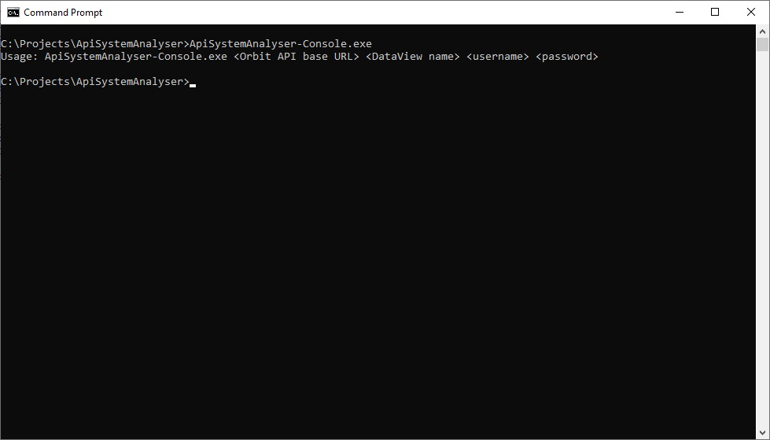
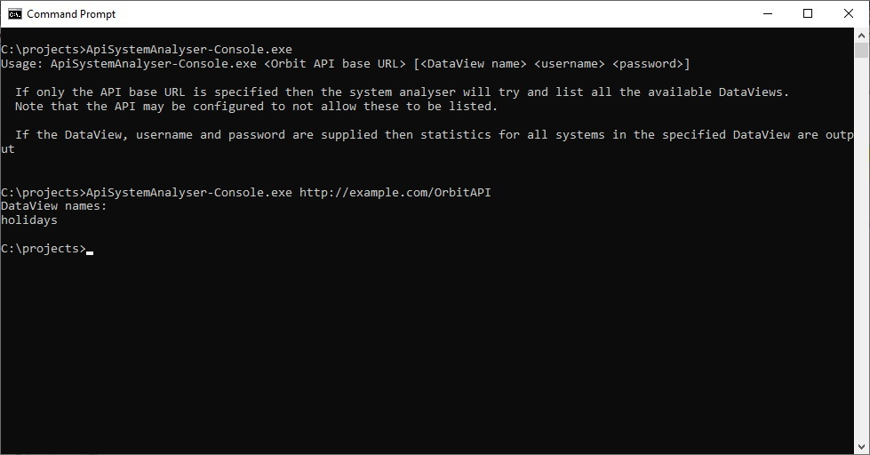
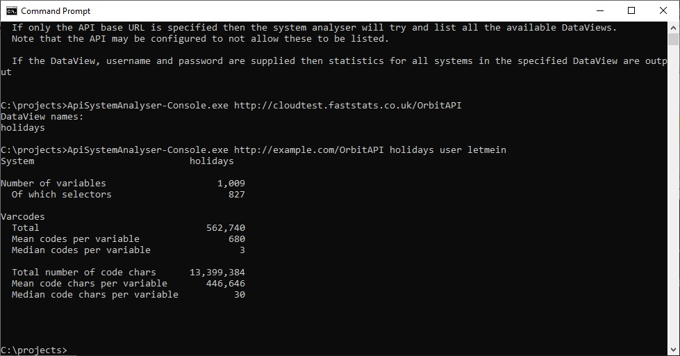

# ApiSystemAnalyser
This is a very simple application that connects to the Apteco API and given a DataView will list
some metadata about an [Apteco FastStats®](https://www.apteco.com/products/faststats) system.

### Background
Apteco FastStats® is part of the [Apteco Marketing Suite](http://www.apteco.com).  It provides a unique
combination of speed and power for data exploration, data mining analysis and customer understanding.

The Apteco API provides programmatic access to information held in an Apteco FastStats® database, as
well as reporting information generated from [Apteco PeopleStage™](https://www.apteco.com/products/peoplestage),
the powerful multi channel campaign automation software.

The ApiSystemAnalyser is a sample application that connects to a Apteco FastStats® system via the
Apteco API to demonstrate how some simple system metadata can be gathered.

### Usage
To use the ApiSystemAnalyser download the latest release from [GitHub](https://github.com/Apteco/ApiSystemAnalyser/releases)
or build the software via Visual Studio or the .Net Core CLI (see [below](#Build)).

To find out what command line parameters are required, run the console application with no parameters:



You will need the name of a DataView to analyse.  To find all the available DataViews configured in the API, run
the application with just the base URL of the API specified:



To get the results for a given DataView, enter the base URL of the API, the name of the DataView you want to connect
to and a valid username and password:



To return these statistics, the ApiSystemAnalyser goes through the following steps:

1. Logs in to the API at the specified URL
2. Gets the list of systems for the specified DataView from the `/{dataViewName}/FastStatsSystems` endpoint.
3. For each system returned:
    1. Get each variable from the `/{dataViewName}/FastStatsSystems/{systemName}/Variables` endpoint and
    accumulate statistics about the variable (number of codes and number of characters in a code, etc).
4. Output the results to the console.

### Implementation
* To see how the ApiClient code was generated from the API's Swagger specification, look at the
Readme in the [Apteco.ApiSystemAnalyser.ApiClient](Apteco.ApiSystemAnalyser.ApiClient) project.

* The [Apteco.ApiSystemAnalyser.Core](Apteco.ApiSystemAnalyser.Core) project contains the business logic for the
application (as described above).

* The [Apteco.ApiSystemAnalyser.Console](Apteco.ApiSystemAnalyser.Console) project contains a console application
entry point that simply gathers the command line parameters and starts the processing.

### Build
To build the project, either do so via Visual Studio (2017 or later) or using the dotnet CLI tool.

##### Visual Studio
Open the ApSystemAnalyser.sln file in Visual Studio and build the project.

To generate the standalone executable, right-click on the Apteco.ApiSystemAnalyser.Console project and choose "Publish...".
Then choose the "Folder Profile" and publish that.  The binaries will be compiled into
`Apteco.ApiSystemAnalyser.Console\bin\Release\netcoreapp2.1\win-x64`

##### dotnet CLI
To build the project so that it will run under any archirecture that .Net Core supports (Windows, Mac OSX, Linux), go to the
root directory and run `dotnet build`.  This will compile the code so that it can be run using the commands:

```
cd Apteco.ApiSystemAnalyser.Console\bin\Debug\netcoreapp2.1
dotnet ApiSystemAnalyser-Console.dll
```

To build a .exe file that will run on the Windows 64 bit platform, go to the root directory and run 
```
dotnet publish -c Release -r win-x64
```

The binaries will be compiled into
`Apteco.ApiSystemAnalyser.Console\bin\Release\netcoreapp2.1\win-x64`
