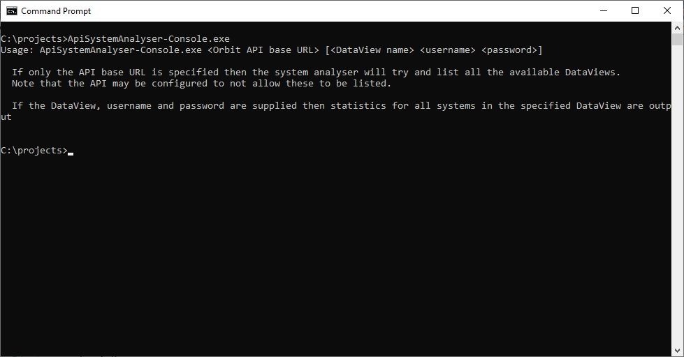
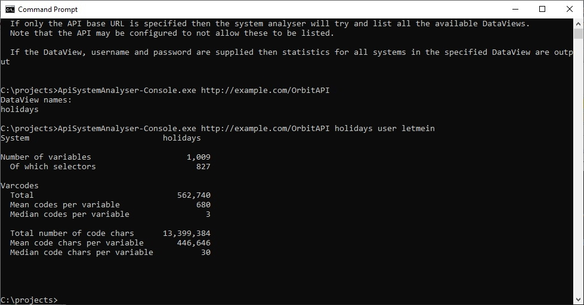

# ApiSystemAnalyser
This is a very simple application that connects to the Apteco API and given a DataView will list
some metadata about an [Apteco FastStats®](https://www.apteco.com/products/faststats) system.

### Background
Apteco FastStats® is part of the [Apteco Marketing Suite](http://www.apteco.com).  It provides a unique
combination of speed and power for data exploration, data mining analysis and customer understanding.

The Apteco API provides programmatic access to information held in an Apteco FastStats® database, as
well as reporting information generated from [Apteco PeopleStage™](https://www.apteco.com/products/peoplestage),
the powerful multi channel campaign automation software.

The ApiSystemAnalyser is a sample application that connects to a Apteco FastStats® system via the
Apteco API to demonstrate how some simple system metadata can be gathered.

### Usage
To use the ApiSystemAnalyser download the latest release or build the software via Visual Studio or the .Net Core CLI.

To find out what command line parameters are required, run the console application with no parameters:

Then enter the base URL of the API, the name of the DataView you want to connect to and a valid username and password:

The ApiSystemAnalyser goes through the following steps:

1. Logs in to the API at the specified URL
2. Gets the list of systems for the specified DataView from the `/{dataViewName}/FastStatsSystems` endpoint.
3. For each system returned:
    1. Get each variable from the `/{dataViewName}/FastStatsSystems/{systemName}/Variables` endpoint and
    accumulate statistics about the variable (number of codes and number of characters in a code, etc).
4. Output the results to the console.

### Implementation
To see how the ApiClient code was generated from the API's Swagger specification, look at the [Readme](Apteco.ApiSystemAnalyser.ApiClient/Readme.md) in the Apteco.ApiSystemAnalyser.ApiClient project.

The Apteco.ApiSystemAnalyser.Core project contains the business logic for the application (as described above).

The Apteco.ApiSystemAnalyser.Console project contains a console application entry point that simply gathers the command line parameters and starts the processing.